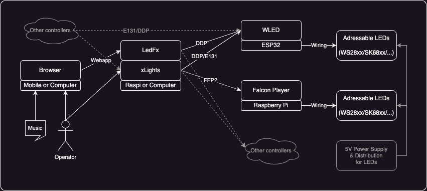
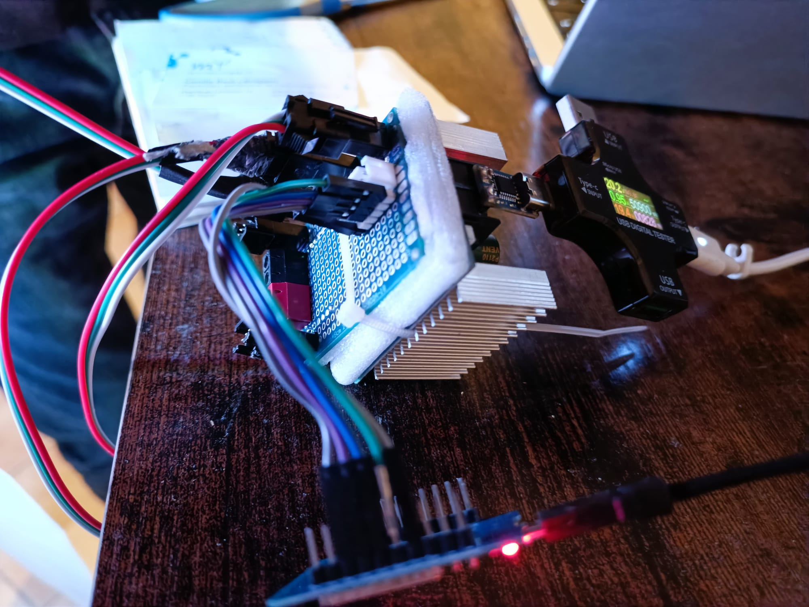

**A semi-professional, low-cost and highly-customizable lighting setup.**

Take today's addressable LEDs (WS28xx, SK68xx, etc.), projectors and plain old lighting devices. Bind it with IoT (ESP32, RaspberryPi, etc.) and Open-Source software for mapping, using the well-known protocols ArtNet, E1.31 (SACn) and maybe the more specific DDP and FFP. What you get ? [Examples](#examples).

Toolchain
-

### Hardware
- ESP32: Microcontroller for driving LEDs data
  - Drives max 3200 LEDs
     https://kno.wled.ge/features/multi-strip/#esp32

- RaspberryPi: Single-Board Computer for driving LEDs data
  - Drives max ? LEDs
     https://falconchristmas.com/forum/index.php?topic=12413.0

- 5V Power Supply & Distribution
  - Strong amperage and distribution system for power reinjection

### Software
- WLED: https://kno.wled.ge
  - Firmware for ESP32 to drive LEDs data (run on ESP32)
  - Support built-in animation, E1.31, DDP

- Falcon Player (FFP): https://falconchristmas.github.io
  - Software to drive LEDs data (cross-platform)
  - Support built-in animation, E1.31, DDP, FFP

- LedFx: https://www.ledfx.app
  - Software to stream animation (cross-platform)
  - Animator, E1.31, DDP, FFP

- xLights: https://xlights.org
  - Software to stream animation (cross-platform)
  - Sequencer animator, E1.31, DDP, FP

- WLEDCast: https://github.com/ppamment/wledcast
  - Software to stream computer screen (cross-platform)
  - Screen streamer, DDP
  - Usage: `wledcast --debug --host <host-ip> --monitor 0`

Alternative free or open-source controller software, to be tested:
- QLC+: https://qlcplus.org

Examples
-

### Power Distribution
A USB-C PD up to 100W with power and data distribution to LEDs segments:
 

### 24x192 LEDs
Video: A LED Panel of 24x192 = 4608 LEDs driven by WLED (that is 18 * 8x24 physical panels):
 

Video: Same panel driven by xLights:
 

Video: Casting screen to LED Panel:
 

Video: Let's make a signage for a friend's shop:
 
